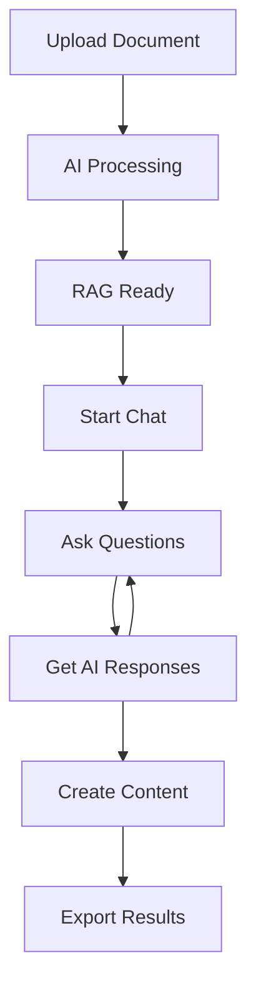
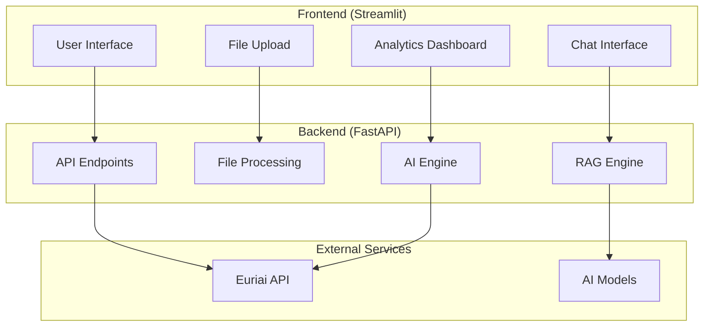

# 🤖 Euriai AI Assistant (Project)

<div align="center">


**🚀 Professional AI-Powered Development Assistant with Document Chat & Code Generation**

[🌟 Features](#-features) • [🚀 Quick Start](#-quick-start) • [💡 Usage](#-usage) • [🔧 Tech Stack](#-tech-stack) • [👥 Credits](#-credits)

</div>

---

## 🌟 Features

<details>
<summary>📁 <strong>Document Analysis & RAG Chat</strong> (Click to expand)</summary>

### 🧠 Intelligent Document Processing
- **📄 Multi-format Support**: PDF, TXT, MD, DOCX, Python files
- **🔍 Smart Text Extraction**: Advanced PDF parsing with fallback methods
- **💬 Persistent Chat**: Ongoing conversations about uploaded documents
- **🧩 RAG (Retrieval-Augmented Generation)**: Context-aware responses
- **📊 Document Chunking**: Intelligent text segmentation for better processing

```python
# Example usage
uploaded_file = st.file_uploader("Upload Document")
# → AI processes document
# → Start persistent chat session
# → Ask questions, get summaries, create content
```

</details>

<details>
<summary>🎯 <strong>Code Assistant</strong> (Click to expand)</summary>

### 🔧 Comprehensive Code Help
- **📖 Code Explanation**: Multi-level explanations (Beginner to Expert)
- **🐛 Smart Debugging**: Error detection and solution suggestions
- **💡 Code Generation**: Custom code with comments and tests
- **🌐 Multi-language**: Python, JavaScript, Java, C++, Go, Rust, TypeScript
- **📚 Educational Formats**: Tutorial, Reference, Detailed, Concise

```python
# Features include:
✅ Concept explanations with examples
✅ Bug detection and fixing suggestions  
✅ Custom code generation with options
✅ Best practices and optimization tips
```

</details>

<details>
<summary>💬 <strong>AI Chat Interface</strong> (Click to expand)</summary>

### 🤖 Intelligent Conversations
- **🔄 Persistent Sessions**: Chat continues until you close it
- **📝 Chat History**: Full conversation tracking
- **💾 Export Options**: Download chat logs as JSON
- **⚡ Real-time Responses**: Fast AI-powered assistance
- **🎨 Professional UI**: Clean, modern interface

</details>

<details>
<summary>📊 <strong>Usage Analytics</strong> (Click to expand)</summary>

### 📈 Smart Cost Tracking
- **💰 Real-time Cost Calculation**: Track API usage and costs
- **📊 Usage Statistics**: Calls, tokens, average costs
- **📋 Historical Data**: Export usage reports
- **🎯 Model Comparison**: Multiple AI models with cost analysis
- **📉 Visual Progress**: Progress bars and metrics

</details>

---

## 🚀 Quick Start

### 📋 Prerequisites
```bash
Python 3.11+
Git
```

### ⚡ Installation

<details>
<summary><strong>🔧 Step-by-step Setup</strong> (Click to expand)</summary>

#### 1️⃣ Clone Repository
```bash
git clone https://github.com/your-username/euriai-ai-assistant.git
cd euriai-ai-assistant
```

#### 2️⃣ Install Dependencies
```bash
pip install -r requirements.txt
```

#### 3️⃣ Environment Setup
```bash
# Create .env file
touch .env

# Add your API key
echo "EURIAI_API_KEY=your_actual_api_key_here" >> .env
echo "TOKEN_LOG_PATH=logs/token_usage.csv" >> .env
echo "LOG_LEVEL=INFO" >> .env
```

#### 4️⃣ Run the Application
```bash
# Terminal 1 - Backend
uvicorn main:app --reload --port 8000

# Terminal 2 - Frontend  
streamlit run app.py --server.port 8501
```

#### 5️⃣ Access the App
- **Frontend**: http://localhost:8501
- **Backend API**: http://localhost:8000
- **API Docs**: http://localhost:8000/docs

</details>

### 📦 Dependencies
```txt
streamlit==1.28.0          # Frontend framework
fastapi==0.104.1           # Backend API
uvicorn[standard]==0.24.0  # ASGI server
sentence-transformers==2.2.2  # RAG embeddings
pypdf==4.0.1               # PDF processing
python-dotenv==1.0.0       # Environment variables
requests==2.31.0           # HTTP client
pandas==2.1.0              # Data processing
nltk==3.8.1                # Text processing
scikit-learn==1.3.0        # ML utilities
```

---

## 💡 Usage

<details>
<summary>📁 <strong>Document Chat Workflow</strong></summary>

### 🔄 Interactive Document Analysis



**Example Conversation:**
```
👤 User: "Summarize this research paper"
🤖 AI: "This paper discusses machine learning applications in healthcare..."

👤 User: "Create a presentation outline based on this"
🤖 AI: "Here's a 10-slide presentation outline: 1. Introduction..."

👤 User: "What are the key findings?"
🤖 AI: "The main findings include: 1. 95% accuracy improvement..."
```

</details>

<details>
<summary>🎯 <strong>Code Assistant Examples</strong></summary>

### 💻 Code Generation
```python
# Input: "Create a web scraper for product prices"
# Output: Complete Python script with error handling

import requests
from bs4 import BeautifulSoup
import pandas as pd

def scrape_product_prices(url):
    """
    Scrape product prices from e-commerce website
    """
    # Implementation with error handling...
```

### 🐛 Debugging Help
```python
# Input: Paste buggy code
# Output: Issue identification + fixes

# ❌ Original issue: NameError
for i in range(10):
    print(counter)  # 'counter' not defined

# ✅ AI suggests:
counter = 0
for i in range(10):
    counter += 1
    print(counter)
```

## 🔧 Tech Stack

<div align="center">

### 🎨 Frontend
  

### ⚙️ Backend  
  

### 🧠 AI & ML
  

### 🗄️ Data Processing
  

</div>

### 🏗️ Architecture



---

## 📊 Project Statistics

<div align="center">

| 📈 Metric | 📊 Value |
|-----------|----------|
| **Lines of Code** | 1,500+ |
| **Files** | 12 |
| **Features** | 15+ |
| **AI Models** | 3 |
| **File Formats** | 6 |
| **Languages** | 7 |

</div>

---

## 🎯 Key Achievements

- ✅ **Professional UI/UX**: Modern, responsive design
- ✅ **RAG Implementation**: Advanced document understanding
- ✅ **Multi-format Support**: Comprehensive file handling
- ✅ **Cost Tracking**: Real-time usage analytics
- ✅ **Error Handling**: Robust fallback mechanisms
- ✅ **Mobile Ready**: Cross-platform compatibility
- ✅ **Scalable Architecture**: Modular design
- ✅ **Documentation**: Comprehensive guides

---

## 🤝 Contributing

<details>
<summary><strong>🔧 Development Setup</strong></summary>

### 🛠️ Local Development
```bash
# Fork the repository
git fork https://github.com/rbi-international/Euri_AI_advanced

# Clone your fork
git clone https://github.com/rbi-international/Euri_AI_advanced

# Create feature branch
git checkout -b feature/amazing-feature

# Install dev dependencies
pip install -r requirements-dev.txt

# Make changes and test
python -m pytest tests/

# Commit and push
git commit -m "Add amazing feature"
git push origin feature/amazing-feature

# Create Pull Request
```

</details>

### 🎯 Contribution Areas
- 🐛 **Bug Fixes**: Report and fix issues
- ✨ **New Features**: Enhance functionality  
- 📚 **Documentation**: Improve guides
- 🎨 **UI/UX**: Design improvements
- 🧪 **Testing**: Add test coverage
- 🌐 **Localization**: Multi-language support

---

## 📄 License

This project is licensed under the **MIT License** - see the [LICENSE](LICENSE) file for details.

```
MIT License - Free for personal and commercial use
✅ Use, copy, modify, merge, publish, distribute
✅ Private and commercial use allowed
❗ Include original license and copyright notice
```

---

## 👥 Credits

<div align="center">

### 🏆 Development Team

<table>
<tr>
<td align="center">
<br />
<sub><b>🔧 Rohit Bharti</b></sub><br />
<sub>Lead Developer</sub><br />
<a href="https://www.linkedin.com/in/rohitbharti13/">LinkedIn</a> • <a href="https://github.com/rbi-international">GitHub</a>
</td>
</tr>
</table>

### 🙏 Special Thanks

<table>
<tr>
<td align="center">
<br />
<sub><b>⚡ Sudhanshu Kumar</b></sub><br />
<sub>Euriai API Provider</sub><br />
<a href="https://www.linkedin.com/in/-sudhanshu-kumar/?originalSubdomain=in">LinkedIn</a> • <a href="https://euron.one/">Euron.one</a>
</td>
<td align="center">
<br />
<sub><b>💡 Bappy Ahmed</b></sub><br />
<sub>Mentor & Inspiration</sub><br />
<a href="https://www.linkedin.com/in/boktiarahmed73/overlay/about-this-profile/">LinkedIn</a>
</td>
</tr>
</table>

### 🔗 Powered By

<div align="center">

[](https://euron.one/)
[](https://streamlit.io/)
[](https://fastapi.tiangolo.com/)

</div>

</div>

---

## 📱 Share This Project

<div align="center">

### 🌟 Found this helpful? Share it!

[](https://www.linkedin.com/sharing/share-offsite/?url=https://github.com/your-username/euriai-ai-assistant)
[](https://twitter.com/intent/tweet?text=Check%20out%20this%20amazing%20AI%20Assistant%20with%20Document%20Chat%20and%20Code%20Generation!&url=https://github.com/your-username/euriai-ai-assistant)
[](https://www.facebook.com/sharer/sharer.php?u=https://github.com/your-username/euriai-ai-assistant)

### ⭐ Star this repo if you found it useful!

[](https://github.com/your-username/euriai-ai-assistant/stargazers)
[](https://github.com/your-username/euriai-ai-assistant/network/members)

</div>

---

<div align="center">

## 🎉 Thank You!

**Made with ❤️ by developers, for developers**

*Building the future of AI-assisted development, one line of code at a time.*

---

[](https://python.org)
[](https://streamlit.io)
[](https://euron.one)

*© 2025 Euriai AI Assistant. All rights reserved.*

</div>